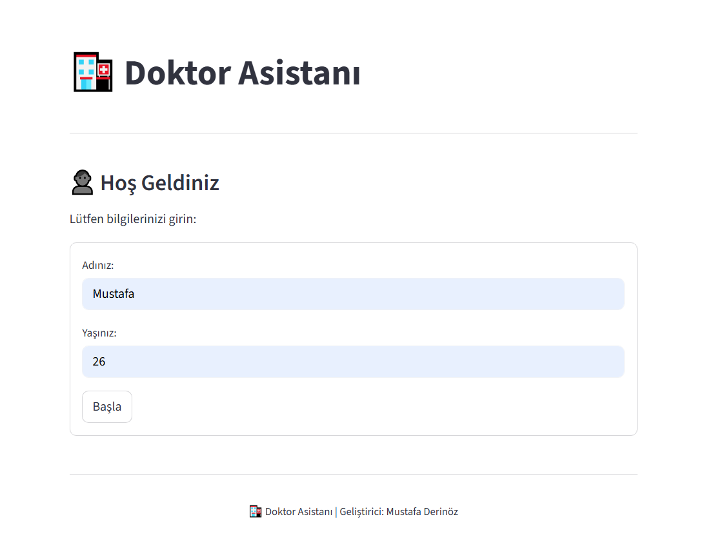
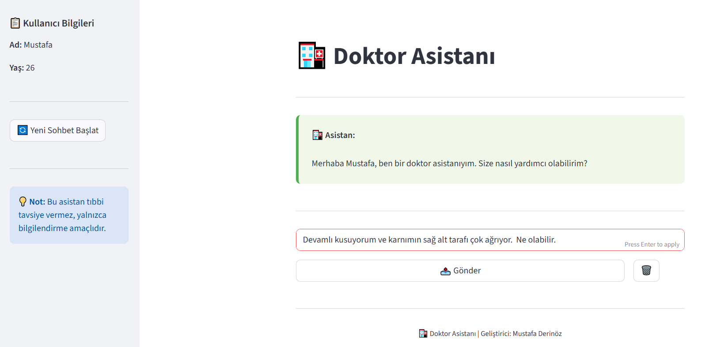
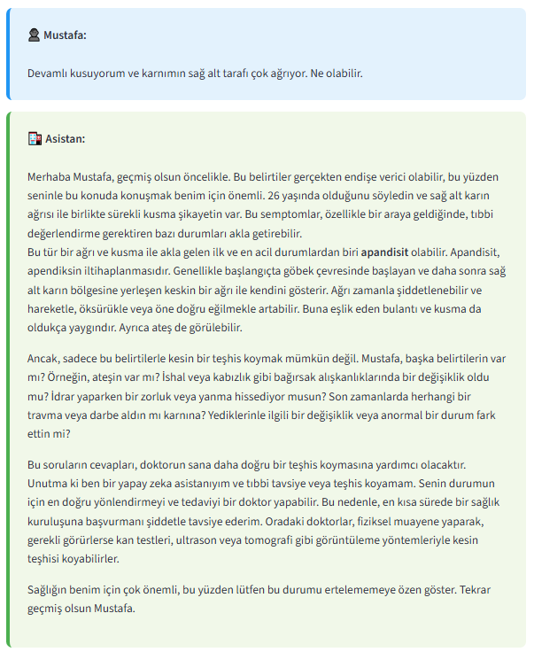

# 🏥 Doktor Asistanı

Yapay zekâ destekli sağlık danışman uygulaması. Kullanıcıdan isim ve yaş bilgisi alarak kişiselleştirilmiş bir sohbet deneyimi sunar.  
Gemini 2.5 Flash lite ile çalışır ve sohbet geçmişini hatırlayabilme özelliğine sahiptir.

---

## 🚀 Özellikler

- 👤 Kişiye özel karşılama ve iletişim
- 💬 Sohbet geçmişini hatırlayan yapay zeka
- 🤖 Gemini 2.5 Flash lite modeli ile yanıt üretme
- 🧠 LangChain ConversationBufferMemory kullanımı
- 🎨 Modern sohbet tasarımı (Streamlit + CSS özelleştirme)
- 🔄 Yeni sohbet başlatma + sohbet temizleme seçenekleri
---
## 🛠 Kullanılan Teknolojiler

| Teknoloji | Açıklama |
|---------|----------|
| Python | Programlama dili |
| Streamlit | Kullanıcı arayüzü |
| LangChain | Sohbet ve hafıza yönetimi |
| Gemini (Google Generative AI) | Yapay zekâ model servisi |
| dotenv | API anahtarı yönetimi |

---
## 📦 Proje Yapısı

```
📦 Proje Klasörü
│
├── venv/                    # Sanal ortam 
├── .env                     # API anahtarı 
└── doctor_assistant.py      # Uygulama dosyası
```
---
## 🛠️ Gerekli Kurulumlar


### 1️⃣ Sanal Ortam Oluşturma

Proje klasörünüzü açtıktan sonra aşağıdaki komutları sırayla çalıştırın:
```bash
python -m venv venv
```

### 2️⃣ Sanal Ortamı Aktif Etme 

```bash
Windows için:
.\venv\Scripts\activate
```
```bash
Mac / Linux için:
source venv/bin/activate
```
### 3️⃣ Gerekli Kütüphanelerin Kurulumu
```bash
pip install google-generativeai langchain langchain-google-genai python-dotenv streamlit
```
### 🔑 API Anahtarı Ekleme

Proje klasörüne .env adında bir dosya oluşturun ve içine aşağıdaki satırı ekleyin:
```bash
API_KEY="YOUR_API_KEY"
```
### ▶️ Uygulamayı Çalıştırma
```bash
streamlit run doctor_assistant.py
```
---

## 📱 Ekran Görüntüleri

| Kayıt / Giriş Ekranı | Ana Sayfa        | 
|----------------------|------------------|
|  |  |

<br><br>
| Sohbet | Sohbet(Devam)     | 
|----------------------|------------------|
|  |  |


---


